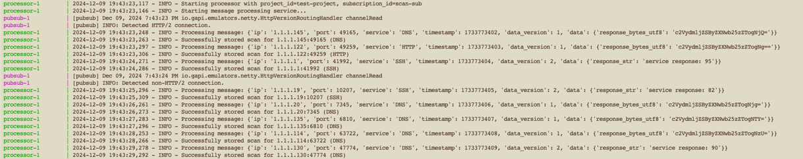

# Mini-Scan Processor

A scalable processor for network scan results that maintains an up-to-date record of discovered services.

## Prerequisites

- Docker and Docker Compose

## Quick Start

The `docker-compose.yml` file sets up a toy example of a scanner. It spins up:

- A Google Pub/Sub emulator
- A topic and subscription
- A scanner service that publishes mock scan results
- One or more processor instances

### Steps
1. Clone this repo
2. Run with:

```bash
docker compose up
```
Logging is enabled by default. After running the above command, you can view the stream in real-time:

The results are persisted in `data/scan_results.db`, which is created after the first run.

## Architecture

### Message Flow

1. Scanner publishes scan results to Pub/Sub topic 'scan-topic'
2. Processor(s) consume messages from subscription 'scan-sub'
3. Each message is validated and normalized
4. Results are stored in SQLite with composite key (ip, port, service)

### Horizontal Scaling

The processor achieves horizontal scaling through:

1. **Stateless Processing**: Each processor instance operates independently
2. **Thread-safe Database**: SQLite operations use transaction isolation
3. **Message Distribution**: Pub/Sub automatically distributes messages across processors
4. **Atomic Updates**: Database upserts prevent race conditions

Scale up processors:

```bash
docker compose up --scale processor=5
```

View processor logs:

```bash
docker compose logs -f processor
```

### At-Least-Once Delivery

The processor ensures reliable message processing:

1. Messages are only acknowledged after successful processing
2. Failed messages are automatically retried with exponential backoff
3. Transaction isolation prevents partial updates

## Dependencies

- `sqlalchemy`: ORM and database operations
- `google-cloud-pubsub`: Pub/Sub client
- `pytest`: Testing framework
- `ruff`: Linting and code style

## Development

Run unit tests:

```bash
pytest processor/tests/
```

Lint code:

```bash
ruff check .
```

## Production Considerations

For a production environment, consider:

- Replace SQLite with a distributed database (e.g., PostgreSQL)
- Add metrics for message processing and latency tracking
- Implement dead-letter queue for failed messages
- Add monitoring and alerting
- Configure resource limits and auto-scaling
